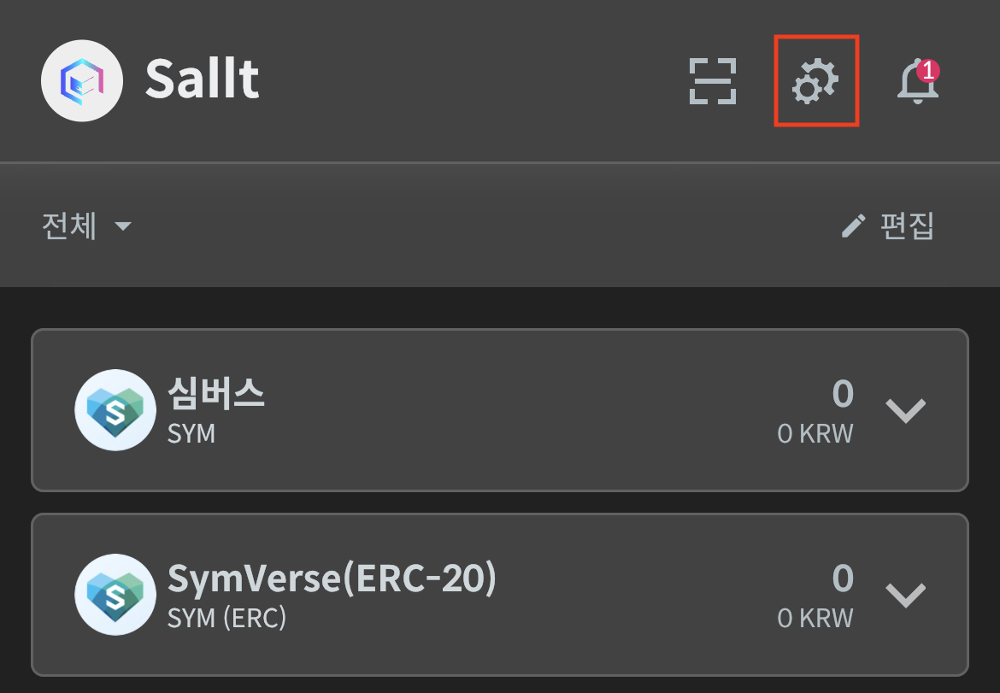
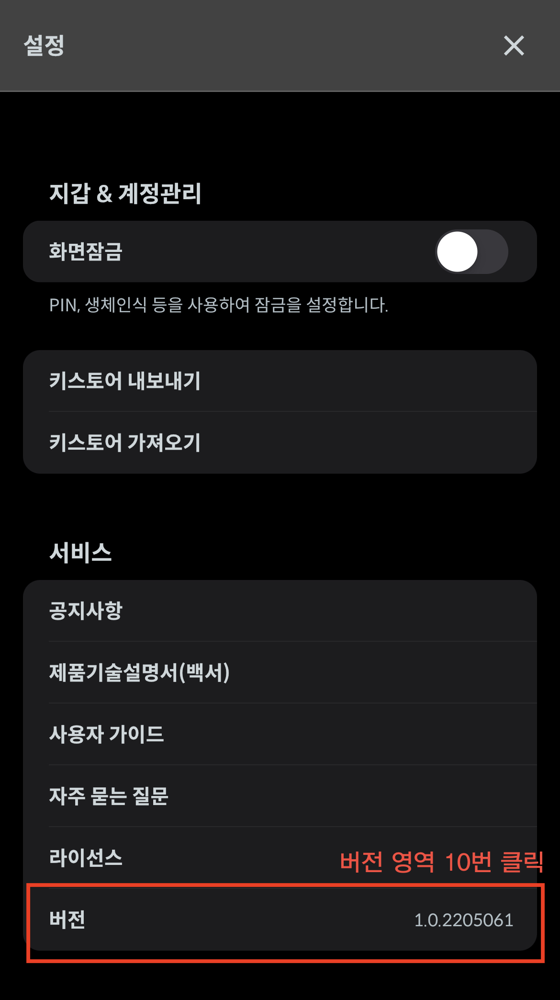
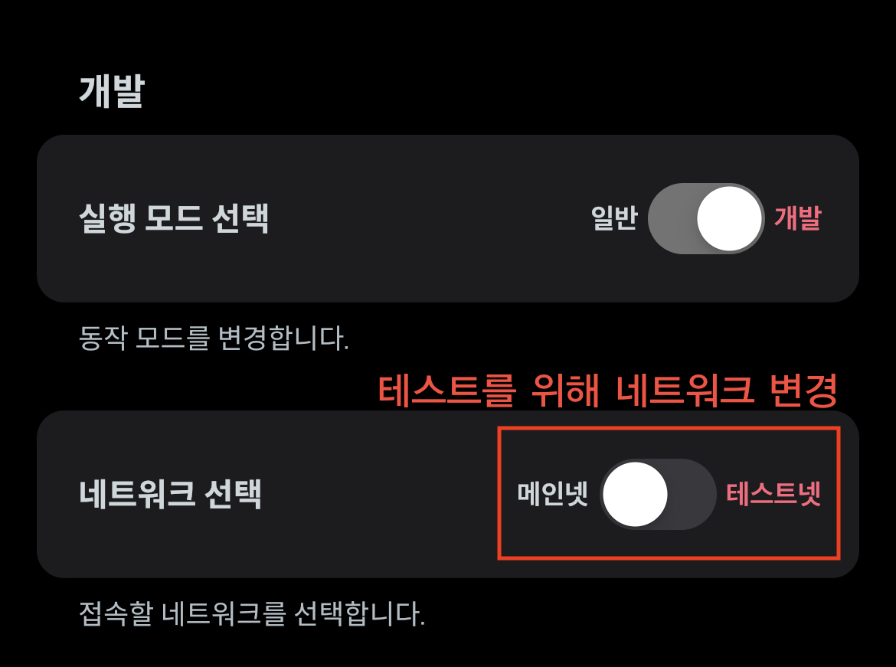

# 테스트넷 전환

&#x20;지갑은 기본적으로 메인넷 네트워크에 맞춰져 있습니다. 또한 지갑을 통한 테스트 제공을 위해아래와 같이 지갑 내의 환경설정을 통해 제공하고 있습니다.

### 개발 모드 활성화

&#x20;지갑 상단에 설정 아이콘을 클릭 한 뒤 맨 아래 '**버전**' 메뉴를 10번 클릭 한 뒤 패스워드 창에 **`2649`**를 입력해주세요.

<figure><figcaption></figcaption></figure>

### 네트워크 '테스트넷' 으로 변경

